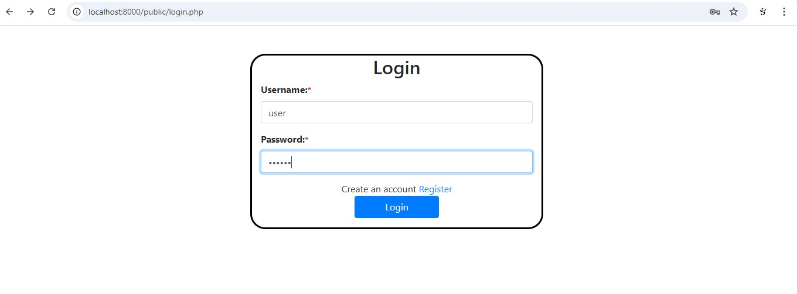
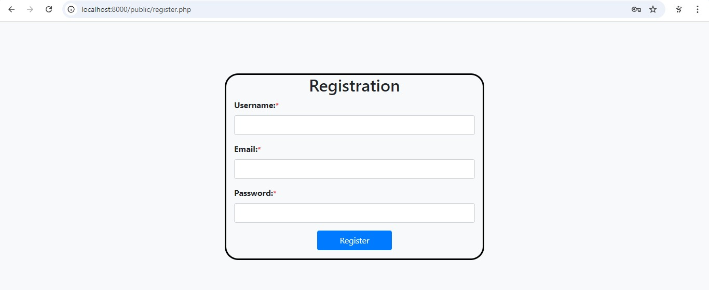
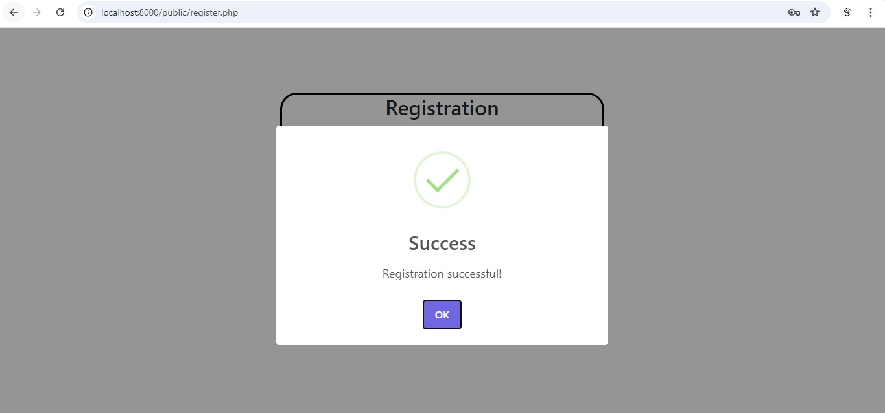

# User Authentication System

This repository contains a simple user authentication system with features such as user registration, login, logout, password hashing, input sanitization, and session management.

## Features

- User Registration
- User Login
- User Logout
- Password Hashing
- Input Sanitization
- CSRF Protection (to be implemented)

## Dependencies

- PHP
- MySQL
- Bootstrap (for styling)
- SweetAlert2 (for alerts)
- Internet

## Setup Instructions

1. **Clone the repository:**
    ```sh
    git clone https://github.com/your-username/your-repo-name.git
    cd your-repo-name
    ```

2. **Create a MySQL database:**
    ```sql
    CREATE DATABASE user_auth;
    ```

3. **Create table:**
    ```sql
    CREATE TABLE users (
        id INT AUTO_INCREMENT PRIMARY KEY,
        username VARCHAR(50) NOT NULL UNIQUE,
        email VARCHAR(100) NOT NULL UNIQUE,
        password VARCHAR(255) NOT NULL,
        created_at TIMESTAMP DEFAULT CURRENT_TIMESTAMP
    );
    ```

4. ## Database Configuration

    The database configuration is defined in the `config/config.php` file. This file contains constants for the database server, username, password, and database name. Here is the relevant section of the code:

    ```php
    <?php
    define('DB_SERVER', 'localhost');
    define('DB_USERNAME', 'root');
    define('DB_PASSWORD', 'root');
    define('DB_NAME', 'user_auth');
    ?>

    Change the values to match your database configuration:

    `DB_SERVER`: The hostname of your database server. For most local setups, this will be localhost.
    `DB_USERNAME`: The username used to connect to your database. Replace 'root' with your actual database username.
    `DB_PASSWORD`: The password used to connect to your database. Replace 'root' with your actual database password.
    `DB_NAME`: The name of the database you created for this project. Ensure it matches the name you used when creating the database.
    Save the changes to the `config/config.php` file.

5. **Star the php application using the following command**
    php -S localhost:8000

6. **Access the application from the local machine through the url**
    http://localhost:8000/public/login.php


## File Descriptions

### `register.php`
Handles user registration by sanitizing input, hashing passwords, and inserting new users into the database. It also checks for existing usernames to prevent duplicates.

### `login.php`
Handles user login by verifying the username and password. It also generates a CSRF token for form submissions and sets session expiration.

### `logout.php`
Destroys the user session and redirects to the login page.

### `index.php`
Displays a dashboard with a session expiration countdown. If the session expires, the user is redirected to the logout page.

### `functions.php`
Contains utility functions such as `sanitize_input` to clean user input.

### `db.php`
Handles database connections using credentials defined in `config.php`.

### `config.php`
Defines database connection constants.

## Security Features

- **Password Hashing:** Passwords are hashed using `password_hash` before storing in the database.
- **Input Sanitization:** User inputs are sanitized using the `sanitize_input` function to prevent XSS and SQL injection attacks.
- **CSRF Protection:** CSRF tokens are generated and verified during form submissions (to be fully implemented).


## Snaps of working model##

## Login


## Register


## Success


